# Desafio#1
## Pipeline que permite crear usuarios en linux
A continuacion se detallan los pasos a seguir para la ejecucion del pipeline:

En el panel de control de Jenkins creamos una nueva tarea

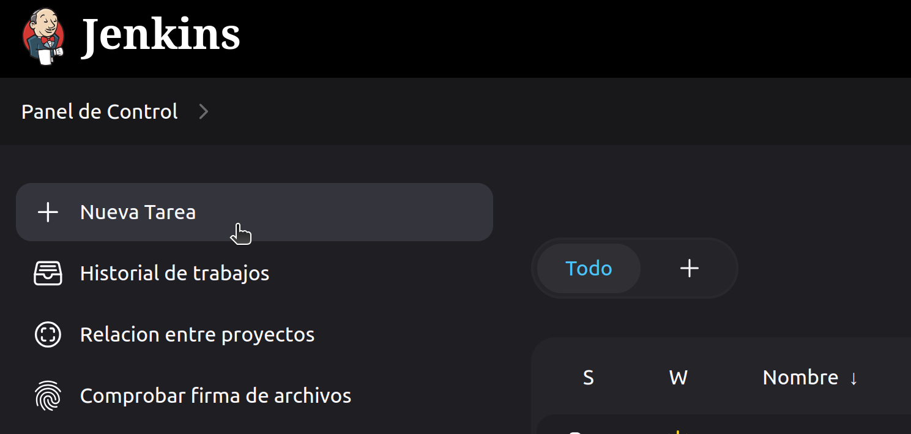

Seleccionamos pipeline y le damos un nombre por ejemplo "desafio1"

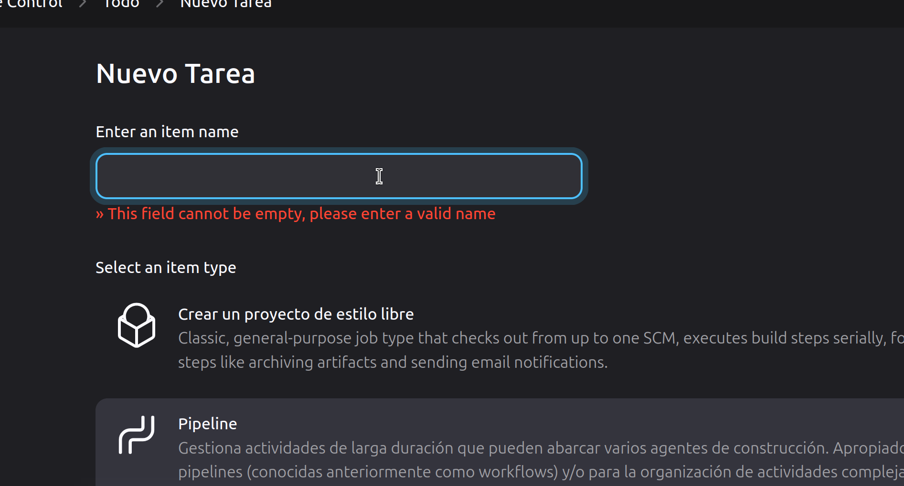

Configuraciones, en general podemos poner una descripcion del pipeline

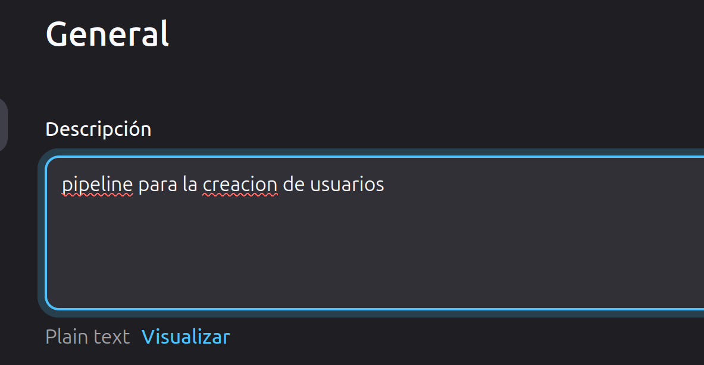

Seleccionamos la opcion "Esta ejecucion debe parametrizarse" y seleccionamos añadir un parametro

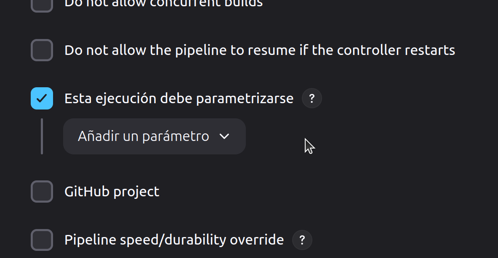

Seleccionamos parametro de cadena, en total van a ser 2 parametros de cadena.

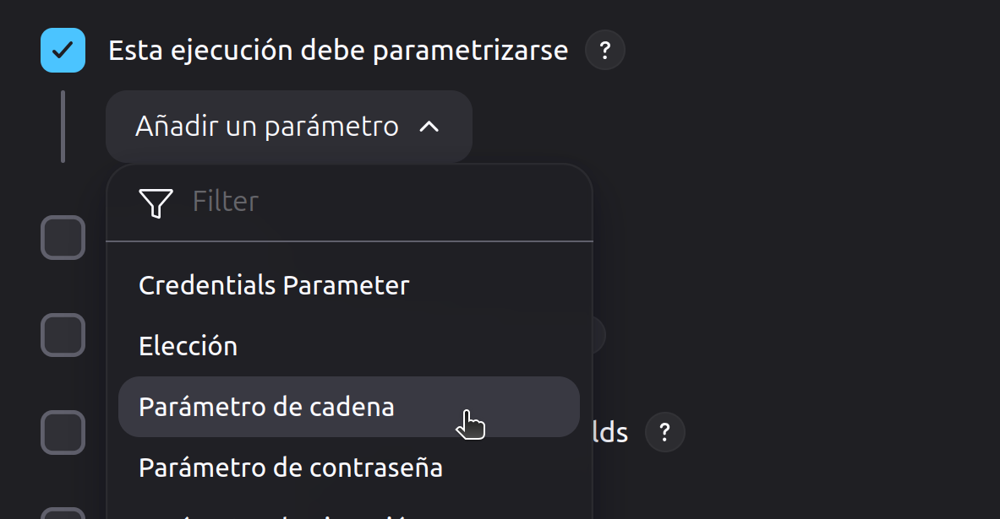

En nombre ponemos "Nombre" y descripcion "Ingrese el nombre del usuario"

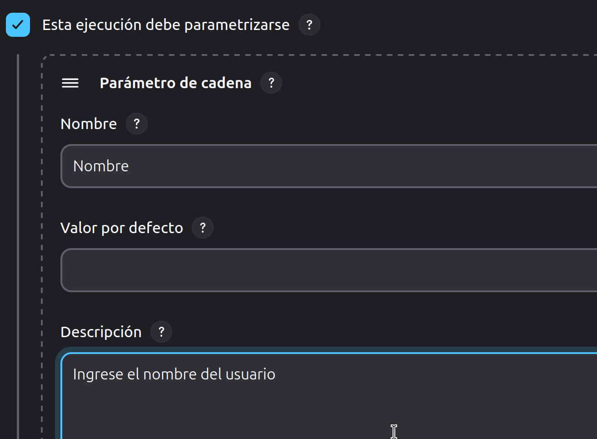

El segundo parametro de cadena: "Apellido" y descripcion "Ingrese el apellido del usuario"

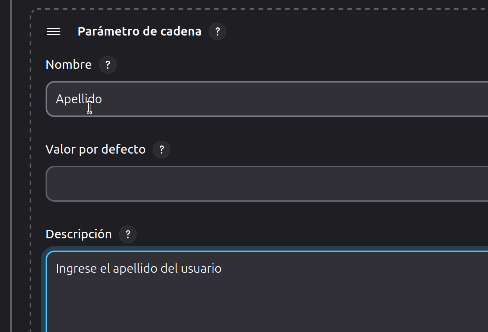

El tercer parametro va a ser un parametro de Eleccion en el que podremos elegir entre mas de una opcion, seleccionamos Eleccion

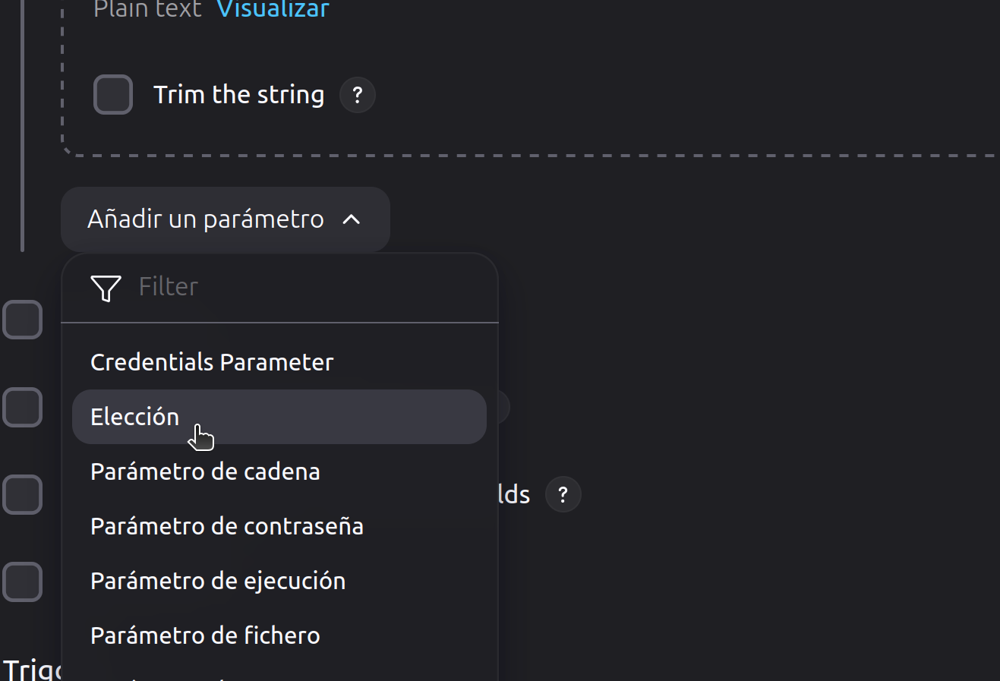

En nombre ponemos "Departamento", en las opciones debemos poner las opciones una por linea que seran los departamentos a los que van a pertenecer los usuarios y en descripcion "Seleccione el departamento"

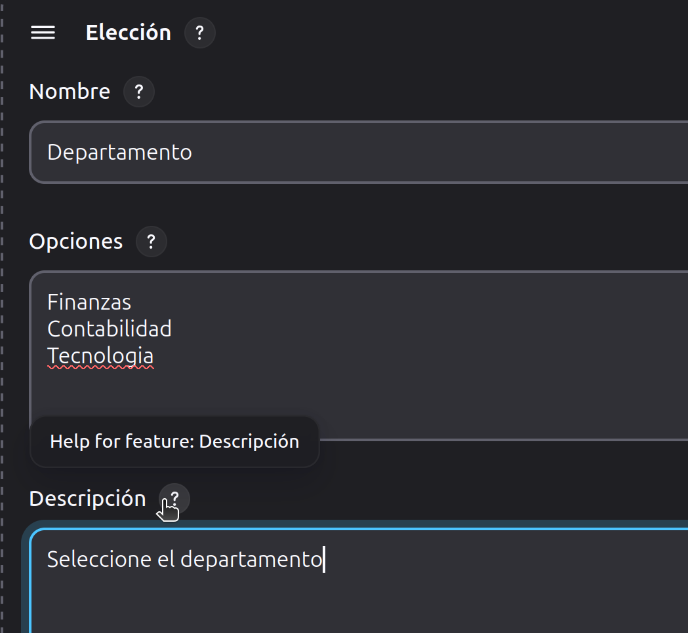

Pasamos a la configuracion del pipeline:

primero en este repositorio de github vamos a copiar la url del repositorio de esta manera:

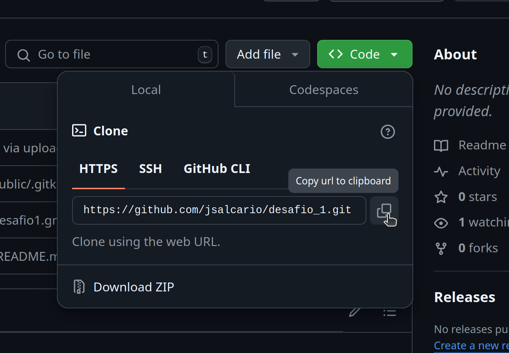

en Definition seleccionamos la opcion Pipeline script from SCM y en SCM seleccionamos Git, en repository URL pegamos el link que copiamos en el paso anterior

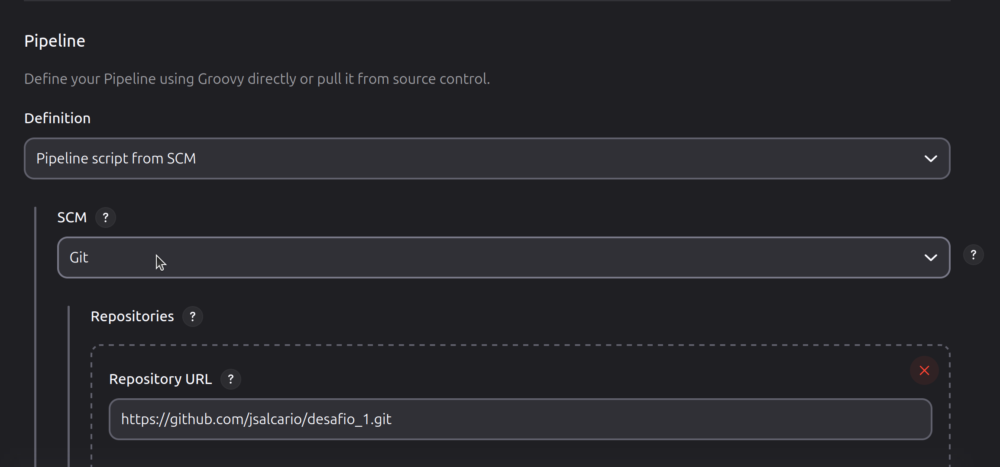

en branchs specifier escribimos main

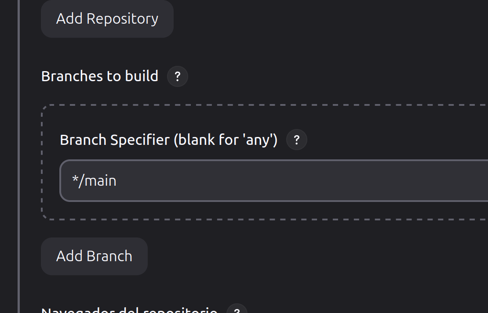

Y en Script Path escribimos la ruta al script y por ultimo damos click al boton Save

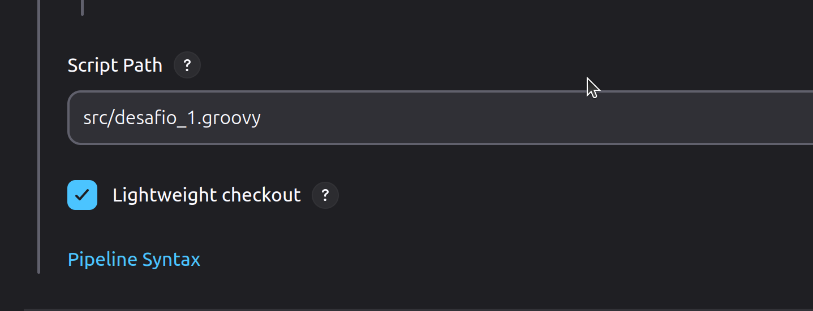

seleccionamos la opcion Build with Parameters

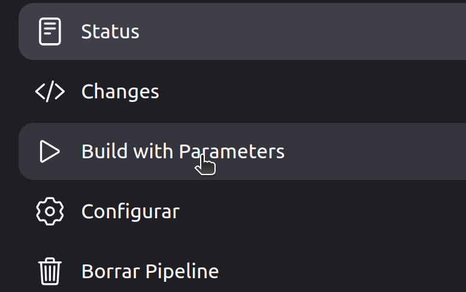

ingresamos tanto el nombre como el apellido del usuario y en las opciones el departamento al que va a pertenecer

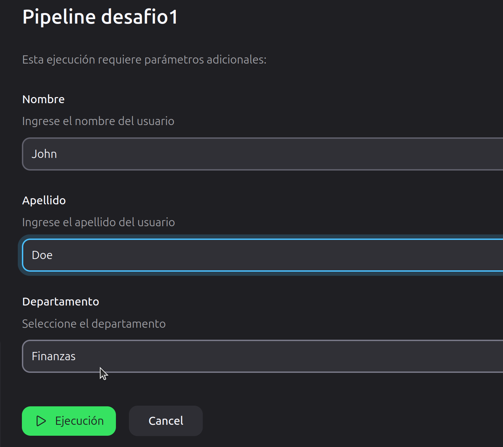

> El programa basicamente crea los grupos, crea los usuarios y le asigna un id y una contraseña y la muestra en pantalla, se puede mejorar a prueba de errores como grupos o usuarios ya existentes, caracteres invalidos o vacios.
> En el directorio public se encuentra el console output de jenkins mostrando que funciona correctamente.
